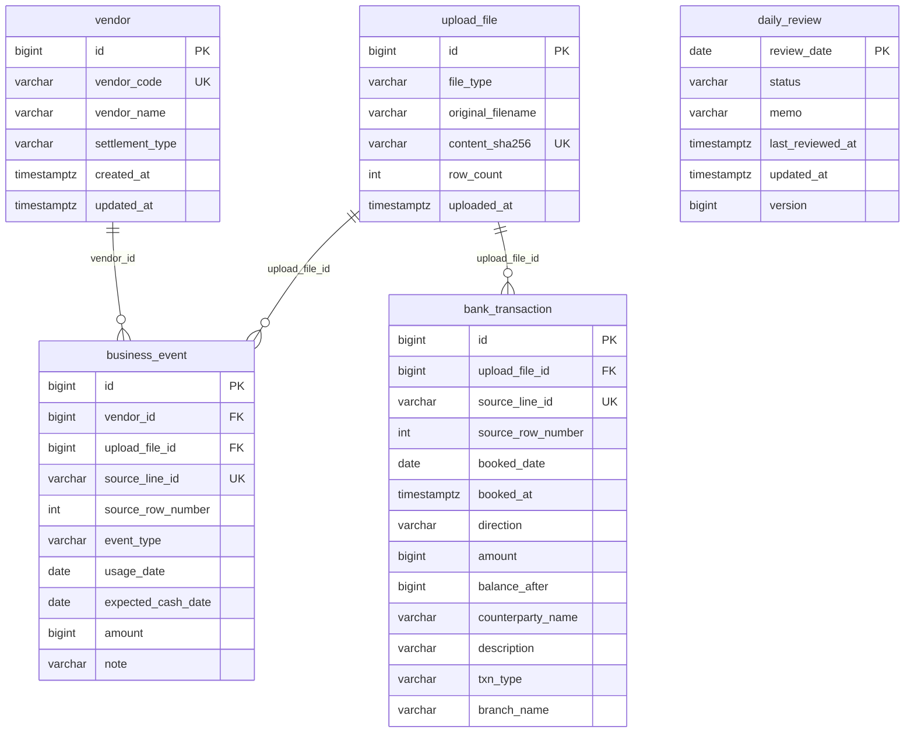

# 입출금 대사 (Java)

소규모 사업자의 **현금 예정**과 **은행 실거래**를 날짜·월 단위로 비교하고, 사람이 검토 상태와 메모를 남기는 로컬 MVP입니다.

실행 단위는 [`backend-java/`](backend-java/README.md)의 Spring Boot 앱입니다. 예정(충전·정산·환불)과 통장 입출금을 각각 합친 뒤 차이를 보여 주며, 합계가 같아도 거래 한 건씩 맞춘 것은 아닙니다. 인증·은행 Open API·거래 단위 자동 매칭은 없습니다.

## 개발 배경

예정 현금과 통장 거래를 스프레드시트에서 날짜별로 맞추던 작업을 API와 화면으로 옮겼습니다. CSV를 올리면 원본 행을 정규화해 저장하고, 일별·월별 합계와 차이를 조회하고, 집계에 들어간 행과 업로드 이력을 추적한 뒤, 날짜 단위로 검토합니다.

입금과 출금은 상계하지 않습니다. `USAGE`(이용)는 저장되지만 현금 합계와 날짜 업무 원본 목록에는 넣지 않습니다.

은행은 **기존 6열 CSV**와 **우리은행 거래 표 7열 CSV**를 받습니다. 우리은행은 표만 추출한 UTF-8 CSV입니다. XLS/XLSX 직접 업로드와 계좌 요약·조회 기간 행은 지원하지 않습니다.

## 주요 화면과 사용 흐름

같은 앱이 정적 화면을 제공합니다. 현재 수동 확인은 `http://localhost:8082/`와 개발 DB `reconciliation_dev`입니다. 포트가 다르면 해당 주소를 씁니다.

1. **거래처** — 코드·이름·선불/후불을 등록하고, 행을 눌러 이름·정산 방식만 수정합니다. 코드는 등록 후 바꿀 수 없습니다.
2. **CSV 업로드** — 업무 CSV와 은행 CSV를 구분해 `file` 필드로 올립니다. 유형별 헤더·한도는 화면의 작성 안내에서 확인합니다.
3. **업로드 이력** — 성공 저장된 파일만 최신순으로 보고, 행을 눌러 메타데이터를 확인합니다.
4. **일별 조회** — 기간을 정해 날짜별 예정/실제/차이·금액 비교·검토 상태를 봅니다. 날짜를 누르면 상세로 갑니다.
5. **월별 조회** — 연월 합계와 데이터 날짜 수·차이 발생 날짜 수를 봅니다.
6. **날짜 상세** — 입금·출금 집계, 업무·은행 원본, 검토 저장. 은행 원본 기본 표는 거래일·거래일시·입출금 구분·거래금액·기재내용·거래구분·거래 후 잔액·취급점입니다. 저장 가능한 상태는 미검토·검토 완료입니다. `NEEDS_RECHECK`(재확인 필요)는 업로드가 원본을 바꾼 뒤에만 생깁니다.

가상 거래처와 합성 CSV만 가정합니다. 단일 회사, **단일 계좌**, 원화 정수입니다. 우리은행 지문은 같은 시각·입출금·금액·잔액이면 한 건으로 보고, 내용이 같아도 별개인 거래는 구별하지 못할 수 있습니다. 기존 6열과 우리은행 양식 사이에서는 같은 실거래 중복을 식별하지 못합니다.

## 핵심 기능

- **거래처** — `POST /api/v1/vendors`, 목록 `GET /api/v1/vendors`, 단건 `GET /api/v1/vendors/{id}`, 수정 `PUT /api/v1/vendors/{id}`.
- **업무·은행 CSV** — `POST /api/v1/uploads/business`, `POST /api/v1/uploads/bank`. 내용 SHA-256과 테이블별 `source_line_id`로 중복을 막습니다. 원본 파일 바이트는 보관하지 않습니다.
- **우리은행 표** — 거래일시·거래구분·기재내용·잔액·취급점을 원문으로 보존합니다. 생성 `source_line_id`는 중복 확인용 지문이며 은행 고유 거래번호가 아닙니다. 기존 6열의 원천 거래 ID와 의미가 다릅니다.
- **일별·월별 집계** — 예정 입금(충전·정산) vs 은행 입금, 예정 출금(환불) vs 은행 출금. 월 합계가 맞아도 날짜별 차이가 있으면 `differenceDayCount`에 반영됩니다.
- **원본·이력** — 날짜별 업무·은행 행, 성공 업로드 목록·단건.
- **검토** — `GET/PUT /api/v1/reconciliations/daily/{date}/review`. PUT 본문의 `version`은 **원본 행이 아니라 `daily_review` 행**의 낙관적 잠금 값입니다. PUT은 원본을 덮어쓰지 않습니다.

## 핵심 설계와 검증

**파일 해시·원천 ID와 전체 롤백.** 같은 내용(SHA-256)이나 이미 있는 `source_line_id`가 있으면 요청 전체를 거절합니다. DB UNIQUE와 애플리케이션 검사가 함께 동작합니다. 저장 트랜잭션이 실패하면 이번 요청의 업로드 메타데이터와 원본 행은 남지 않습니다.

**파싱과 저장을 나눕니다.** Facade가 트랜잭션 밖에서 파일을 읽고 파싱합니다. 파서가 거절하면 저장 트랜잭션에 들어가지 않아 실패 이력도 생기지 않습니다.

**CSV 검증을 공통으로 모았습니다.** 한도·오류 가방·기존 6열/업무 금액 해석을 공유하고, 우리은행 금액만 전용 규칙을 씁니다.

**집계는 쪽마다 먼저 합칩니다.** CTE로 업무·은행을 날짜별 `GROUP BY`한 다음 날짜 UNION으로 붙입니다.

**금액 차이가 같아도 원본이 바뀌면 재확인합니다.** 성공 업로드가 `REVIEWED`인 영향 날짜만 `NEEDS_RECHECK`로 바꿉니다. PUT으로 `NEEDS_RECHECK`를 넣을 수는 없습니다.

**날짜 잠금과 검토 `version`으로 동시 저장을 막습니다.** 업로드와 검토 저장은 영향 날짜를 잠급니다. PUT은 요청 `version`이 잠긴 행과 다르면 409입니다.

화면에서는 같은 뷰를 다시 열 때 조회가 두 번 나가던 호출을 없앴습니다.

자동 테스트는 보호된 PostgreSQL `reconciliation_test`에서만 돌립니다. 개발 DB와 섞지 않습니다.

- Gradle HTML 보고서 `backend-java/build/reports/tests/test/index.html` **2026-10-02 13:15:42**: 실행 45 · 성공 45 · 실패 0 · 건너뜀 0.
- `BankUploadIntegrationTest` 9개(기존 6 + 우리은행 신규 3)가 포함되어 통과했습니다.
- 같은 실행에서 `reconciliation_test`에 Flyway V7(`bank woori statement fields`)을 적용했고, 스키마 버전은 v7입니다.

사용자가 8082 화면에서 업로드 동작을 확인했다고 전달했습니다. 그 이상의 HTTP 상태·원본 값 대조·재업로드 거절·건수 유지를 이 문서에서 확인된 것으로 적지 않습니다. 개발 DB의 V7 적용은 여기서 단정하지 않습니다.

## 기술 스택

| 구성 | 버전·출처 | 역할 |
| --- | --- | --- |
| Java | 21 | 런타임 (`backend-java/build.gradle` toolchain) |
| Spring Boot | 4.1.1 | Web MVC, Validation, 트랜잭션 |
| Spring Data JPA | Boot BOM | 영속화. `ddl-auto: validate` |
| Flyway | Boot 스타터 | PostgreSQL 스키마 V1–V7 |
| PostgreSQL | 서버 버전은 환경에 따름 | 개발·테스트 DB. H2 없음 |
| PostgreSQL JDBC | `org.postgresql:postgresql` (Boot BOM) | JDBC 드라이버. DB 서버 버전이 아님 |
| Apache Commons CSV | 1.14.0 | CSV 파싱 |
| Gradle Wrapper | 9.7.1 | 빌드·테스트·기동 |

패키지 `com.smallbiz.reconciliation`: `health`, `vendor`, `upload`, `reconciliation`, `common`.

## 현재 Java ERD

Flyway V1–V7. V7은 `bank_transaction`에 `booked_at`, `balance_after`, `txn_type`, `branch_name`을 추가합니다. 기존 6열 행은 이 값이 NULL입니다. `daily_review`의 기본 키는 `review_date`입니다. 다른 테이블과 외래 키는 없습니다. `version`은 이 검토 행의 `@Version`입니다.

## 실행·API

기동, 환경 변수, 합성 CSV, curl 예, 화면 접속은 [`backend-java/README.md`](backend-java/README.md)를 따릅니다. 집계·검토 규칙과 CSV 헤더는 [`backend-java/docs/design.md`](backend-java/docs/design.md)입니다.

시연 전용 DB 생성은 필수가 아닙니다. 새 PowerShell에서도 `backend-java`로 이동한 뒤 JDK 21과 `DB_*` / `TEST_DB_*`를 넣고, 비밀번호는 `Read-Host -AsSecureString`과 `try/finally`로 다룹니다.

| 구분 | 경로 |
| --- | --- |
| 기동 확인 | `GET /health` |
| 거래처 등록·목록 | `POST /api/v1/vendors`, `GET /api/v1/vendors` |
| 거래처 단건·수정 | `GET /api/v1/vendors/{id}`, `PUT /api/v1/vendors/{id}` |
| CSV 업로드 | `POST /api/v1/uploads/business`, `POST /api/v1/uploads/bank` |
| 업로드 이력 | `GET /api/v1/uploads`, `GET /api/v1/uploads/{uploadId}` |
| 일별·월별 집계 | `GET /api/v1/reconciliations/daily`, `GET /api/v1/reconciliations/monthly` |
| 날짜별 원본 | `GET /api/v1/reconciliations/daily/{date}/business`, `.../bank` |
| 검토 | `GET/PUT /api/v1/reconciliations/daily/{date}/review` |

## 구현 범위

인증 없는 로컬 MVP입니다. 거래처, 업무·기존 6열·우리은행 표 CSV, 일별·월별 비교, 원본·이력, 날짜별 검토·재확인, 정적 화면까지 포함합니다.

포함하지 않는 것: 로그인, 은행 Open API, XLS/XLSX 직접 업로드, 거래 단위 자동 매칭, 원본 CSV 재다운로드, 실패 업로드 이력, 거래처별 은행 대사 확정. 거래처별 업무 원본 목록은 설계만 있고 API는 없습니다.

[`app/`](app/)은 FastAPI 전표 실험입니다. 기본 DB는 루트 SQLite(`accounting.db`), 스키마는 [`migrations/`](migrations/). Java 앱과 프로세스·데이터베이스를 공유하지 않습니다.

전표 중심 초안 ERD는 [`docs/legacy-erd.md`](docs/legacy-erd.md)에 있으며, 현재 Java 스키마가 아닙니다.
