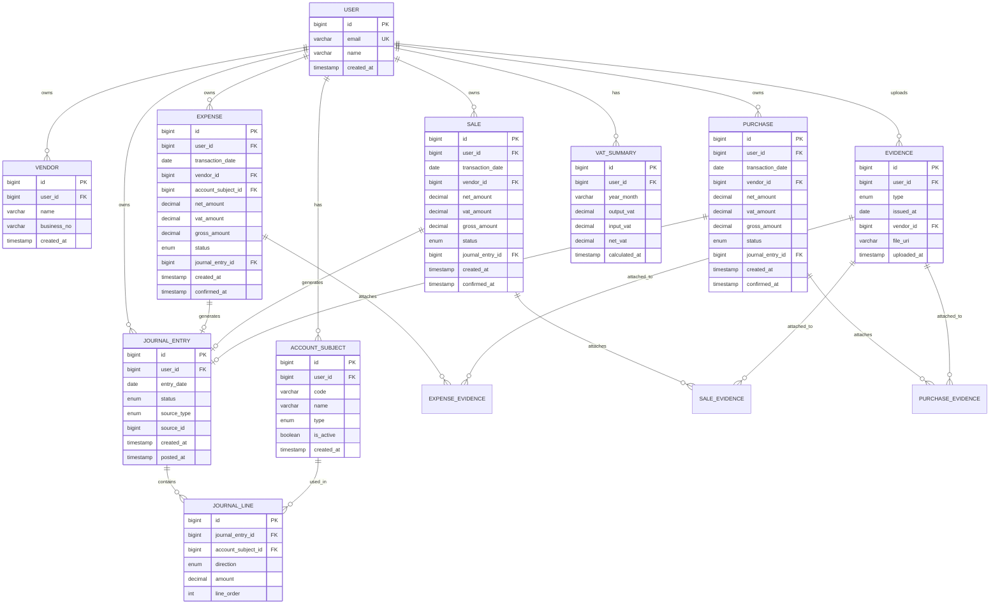

# smallbiz-accounting-backend

소규모 사업자 **입출금·정산 대사** 백엔드입니다.

업무 CSV의 입금·출금 예정과 은행 CSV의 실제 거래를 날짜 기준으로 비교합니다. 인증 없는 로컬 MVP이며 가상 거래처·합성 데이터만 사용합니다.

**지금 실행하는 앱은 [`backend-java/`](backend-java/README.md)입니다.** 설계는 [`backend-java/docs/design.md`](backend-java/docs/design.md)를 봅니다.

## 무엇을 하는가

- 단일 회사, 단일 계좌, 원화
- 거래처별 대사는 하지 않음
- 입금과 출금을 상계하지 않음
- 합계 일치(`TOTAL_EQUAL`)는 거래별 매칭이나 사람 검토 완료가 아님
- 원본 CSV 파일은 보관하지 않음. 재다운로드 API 없음

루트의 Python FastAPI(`app/`)와 SQLite(`accounting.db`)는 **이전 전표 실험**입니다. 삭제하거나 Java로 대체하지 않습니다. DB와 프로세스도 분리합니다.

## 구성

| 경로 | 역할 |
| --- | --- |
| `backend-java/` | Spring Boot 대사 API (Java 21, Boot 4.1.1, PostgreSQL, Flyway) |
| `backend-java/docs/design.md` | 집계 규칙, 테이블, API |
| `app/`, `migrations/`, `accounting.db` | Python 전표 실험. Java가 스키마를 변경하지 않음 |
| `_spring_init/`, `backend-java-init.zip` | Spring 초기 생성물. 저장소에 올리지 않음 |

PostgreSQL은 이 앱 전용으로 **개발 DB**와 **테스트 DB**를 따로 둡니다. 테스트는 `reconciliation_dev`를 거부합니다. 비밀번호는 저장소에 적지 않습니다.

## 진행 상태

원격 `main`에 있는 것:

| 구분 | API |
| --- | --- |
| 기동 | `GET /health` |
| 거래처 | `POST/GET/PUT /api/v1/vendors` |
| 업로드 | `POST /api/v1/uploads/business`, `POST /api/v1/uploads/bank` |
| 집계 | `GET /api/v1/reconciliations/daily`, `GET /api/v1/reconciliations/monthly` |
| 원본 | `GET /api/v1/reconciliations/daily/{date}/business`, `.../bank` |
| 이력 | `GET /api/v1/uploads`, `GET /api/v1/uploads/{uploadId}` |

Flyway V1–V5. 통합 테스트 33개는 테스트 DB에서 통과한 기록이 있습니다.

남은 MVP:

1. 날짜별 검토 상태·메모 (`PUT .../daily/{date}/review`)
2. (선택) 거래처별 업무 원본
3. 화면

인증, 실제 은행 연동, 거래처별 대사, 실패 업로드 이력 저장은 MVP 밖입니다.

## 실행

자세한 명령·CSV 예·curl은 [`backend-java/README.md`](backend-java/README.md)를 따릅니다.

요약: JDK 21, `DB_URL` / `DB_USERNAME` / `DB_PASSWORD`로 `reconciliation_dev`에 연결한 뒤 `backend-java`에서 `.\gradlew.bat bootRun`입니다. 로컬에서 8080이 쓰이면 `--server.port=8081`을 씁니다. 테스트는 `TEST_DB_*`로 `reconciliation_test`만 가리킵니다.

## 이전 전표 실험 (Python)

아래 ERD는 FastAPI 전표 모델입니다. 현재 Java 대사 스키마(`vendor`, `upload_file`, `business_event`, `bank_transaction`)와 다릅니다.

