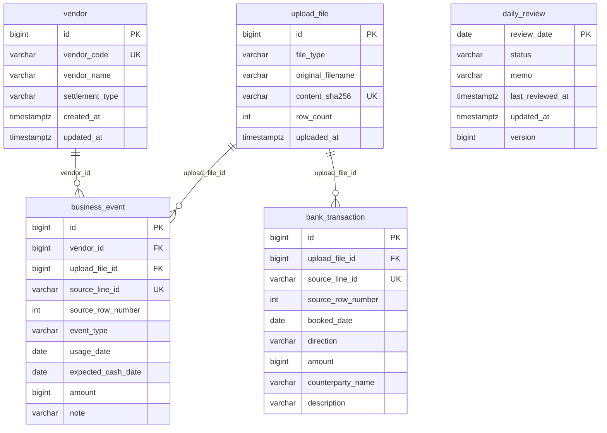

# smallbiz-accounting-backend

소규모 사업자의 **현금 예정 내역**과 **은행 거래 내역**을 일별·월별로 비교하고, 차이를 사람이 검토하는 입출금 대사 시스템입니다.

현재 실행·검증의 중심은 Java Spring Boot 앱 [`backend-java/`](backend-java/README.md)입니다. 집계 규칙과 테이블 정의는 [`backend-java/docs/design.md`](backend-java/docs/design.md)에 있습니다. 거래처·CSV 업로드·이력·대사 조회·검토 화면은 같은 앱의 정적 페이지입니다.

## 개발 배경

업무 쪽 입금·출금 예정과 통장 실제 거래를 Excel에서 날짜별로 맞춰 보던 흐름을 API로 옮겼습니다. CSV를 올리면 원본을 저장하고, 날짜 합계와 차이를 조회하고, 합계에 들어간 행과 업로드 이력을 추적한 뒤, 날짜 단위로 검토 상태와 메모를 남깁니다.

합계가 같다고 해서 거래가 하나씩 맞았거나 검토가 끝난 것은 아닙니다. 인증, 실제 은행 연동, 거래 자동 매칭은 구현하지 않았습니다.

## 핵심 기능

구현된 기능만 적습니다.

- **거래처 관리** — 코드, 이름, 선불·후불 정산 유형 등록·조회·수정. 코드는 생성 후 바꾸지 않습니다.
- **업무·은행 CSV 업로드** — 예정 현금(충전·정산·환불)과 이용(`USAGE`), 은행 입출금을 정규화해 저장합니다. 원본 CSV 바이트는 보관하지 않습니다.
- **일별·월별 비교** — 예정 입금/출금과 실제 입금/출금을 각각 비교합니다. 입금과 출금을 상계하지 않습니다.
- **원본·업로드 이력** — 집계에 쓰인 날짜의 업무·은행 행과, 성공 저장된 업로드 메타데이터를 조회합니다.
- **검토 화면** — 브라우저에서 거래처, CSV 업로드, 업로드 이력, 일별·월별 집계, 날짜 상세(원본·검토 저장)를 다룹니다.

가상 거래처와 합성 CSV만 가정합니다. 단일 회사, 단일 계좌, 원화 정수입니다.

## 기술 스택과 구조

| 구성 | 버전 | 역할 |
| --- | --- | --- |
| Java | 21 | 애플리케이션 런타임 (`backend-java/build.gradle`) |
| Spring Boot | 4.1.1 | Web MVC, Validation, 트랜잭션 |
| Spring Data JPA | Boot BOM | 거래처·업로드 원본·검토 행의 영속화. `ddl-auto: validate` |
| Flyway | Boot 스타터 | PostgreSQL 스키마 V1–V6 |
| PostgreSQL | JDBC 드라이버 | 개발·테스트 전용 DB. H2는 쓰지 않음 |
| Apache Commons CSV | 1.14.0 | 따옴표·필드 안 쉼표가 있는 CSV 파싱 |
| Gradle Wrapper | 9.7.1 | 빌드·테스트·기동 |

핵심 패키지 (`com.smallbiz.reconciliation`):

```text
backend-java/src/main/java/com/smallbiz/reconciliation/
  health/           기동 확인
  vendor/           거래처 API
  upload/           CSV 파싱·저장, 업로드 이력
  reconciliation/   일별·월별 집계, 원본 조회, 검토
  common/           오류 응답
```

현재 Java 스키마(Flyway V1–V6)는 아래와 같습니다. `daily_review`는 날짜 기본 키만 있으며 다른 테이블과 외래 키가 없습니다.



## 핵심 설계

**파싱과 저장을 나눕니다.** 잘못된 CSV를 DB 트랜잭션 안에서 읽으면 연결을 오래 잡고 실패 이력이 남을 수 있습니다. Facade가 파일을 읽고 검증한 뒤, Service만 `@Transactional`로 저장합니다. 파서가 거절하면 테이블에 이번 요청 행이 생기지 않습니다.

**같은 파일·같은 원천 ID는 요청 전체를 거절합니다.** 일부 행만 넣으면 합계가 원본과 어긋납니다. 내용 SHA-256과 테이블별 `source_line_id` 유일 제약으로 막고, 검증 실패 시 추가하려던 업로드·원본을 롤백합니다.

**업무와 은행을 각각 날짜별로 합친 뒤 붙입니다.** 같은 날짜의 원본 행을 바로 JOIN하면 행 수끼리 곱해져 금액이 커집니다. CTE로 쪽마다 `GROUP BY`한 다음 날짜 UNION으로 결합합니다.

**입금과 출금을 따로 보고, 월 합계와 일별 차이를 구분합니다.** 충전·정산 예정은 은행 입금과, 환불 예정은 은행 출금과 비교합니다. 월 합계 차이가 0이어도 날짜별로 어긋난 날이 있을 수 있어 `differenceDayCount`를 둡니다.

**검토는 원본 버전과 날짜 잠금으로 지킵니다.** 화면의 오래된 저장이 나중에 올라온 원본을 덮어쓰면 안 됩니다. 성공 업로드와 검토 저장이 같은 날짜 행을 잠그고 버전을 올리며, 버전이 다르면 409로 거절합니다. `USAGE`만 있는 날은 현금 대사 대상이 아니어서 검토를 저장하지 않습니다.

## 실행·API·검증

기동, 환경 변수, 합성 CSV, curl 예, 화면 접속은 [`backend-java/README.md`](backend-java/README.md)를 따릅니다.

| 기능 | 경로 |
| --- | --- |
| 기동 확인 | `GET /health` |
| 거래처 | `POST/GET/PUT /api/v1/vendors` |
| CSV 업로드 | `POST /api/v1/uploads/business`, `POST /api/v1/uploads/bank` |
| 업로드 이력 | `GET /api/v1/uploads`, `GET /api/v1/uploads/{uploadId}` |
| 일별·월별 집계 | `GET /api/v1/reconciliations/daily`, `GET /api/v1/reconciliations/monthly` |
| 날짜별 원본 | `GET /api/v1/reconciliations/daily/{date}/business`, `.../bank` |
| 검토 | `GET/PUT /api/v1/reconciliations/daily/{date}/review` |

통합 테스트는 PostgreSQL 테스트 DB에서 돌립니다. Gradle HTML 보고서(`backend-java/build/reports/tests/test/index.html`) **2026-10-01 11:38:22 실행** 기준, 실행 42 · 성공 42 · 실패 0 · 건너뜀 0입니다.

## 현재 범위와 다음 계획

**지금:** 거래처, 업무·은행 CSV, 일별·월별 합계 비교, 원본·이력 조회, 날짜별 검토·재확인, 조회·검토·거래처·업로드 화면. 인증 없는 로컬 MVP입니다.

**예정:** 거래처별 업무 원본 목록은 설계에만 있고 API는 없습니다.

**하지 않는 것:** 은행 Open API, 거래 단위 자동 매칭, 원본 CSV 재다운로드, 실패 업로드 이력 저장, 거래처별 은행 대사 확정.

## 저장소의 Python 앱

[`app/`](app/)은 FastAPI 전표 실험입니다. 거래처·계정과목·분개 API가 있고, 기본 DB는 루트의 SQLite(`accounting.db`)입니다. 스키마는 [`migrations/`](migrations/)의 Alembic 이력을 따릅니다. Java 앱과 프로세스·데이터베이스를 공유하지 않으며, Java Flyway가 이 스키마를 바꾸지 않습니다. Python을 Java 대사 API로 대체했다고 보지는 않습니다.

## 초기 설계안

전표 중심 초안 ERD는 [`docs/legacy-erd.md`](docs/legacy-erd.md)에 있습니다. 현재 Java 구현 스키마가 아닙니다.
